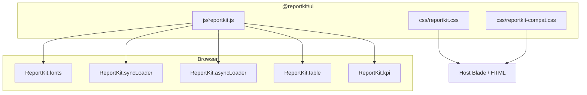

# @reportkit/ui

Browser CSS + JS for **ReportKit** — CAS design tokens, page chrome, sync/async loaders, and first-class DataTables helpers.

> Package: `@reportkit/ui` · ES5 / jQuery · DataTables optional  
> Sibling engine: [`reportkit/core`](https://github.com/Maijied/Reportkit-Core)  
> Repository: [Maijied/Reportkit-UI](https://github.com/Maijied/Reportkit-UI)

## Author

**Mohammad Maizied Hasan Majumder**  
[mdshuvo40@gmail.com](mailto:mdshuvo40@gmail.com)

Founder & Principal Engineer at [Lorapok Labs](https://lorapok.labs) · Senior Software Engineer @ [Shohoz Ltd](https://shohoz.com)

## Architecture



Layout order (CAS):

**page-head → filter → summary → KPI → panels → loaders → send → howto**

## Features

| CAS (design source) | ReportKit |
|---------------------|-----------|
| `--cas-green` `#0b7a4b` | `--rk-accent` |
| `.sales-page-head` | `.rk-page-head` |
| `.search-pan` | `.rk-filter-pan` (+ `.search-pan` alias) |
| `.cas-filter-summary` | `.rk-filter-summary` |
| `.sales-kpi-card` | `.rk-kpi-card` |
| `.cas-table-scroll` | `.rk-table-x` / `.rk-panel` |
| `.sales-tables-loading` | `.rk-sync-loading` |

### JS surface

| API | Purpose |
|-----|---------|
| `ReportKit.fonts.ensure()` | Inject Manrope/Sora |
| `ReportKit.syncLoader.*` | Classic form overlay |
| `ReportKit.asyncLoader.*` | Prepare progress overlay |
| `ReportKit.table.mount()` | DataTables serverSide mount |
| `ReportKit.table.toPreparedRows(api)` | Export current view — **no re-query** |
| `ReportKit.kpi.apply()` | Fill KPI cards from summary JSON |

## Requirements

- Peer: **jQuery ≥ 1.10.0**
- Optional peer: DataTables (`datatables.net`) for `ReportKit.table.mount`

## Install

```bash
npm install @reportkit/ui
# or copy css/ + js/ into your public assets
```

Until npm publish, use this repository directly (git subtree / raw copy).

Published `files`: `css/`, `js/`, `docs/`, `LICENSE`, `AUTHORS.md`, `README.md`.

### HTML

```html
<link rel="stylesheet" href="path/to/reportkit.css">
<!-- optional CAS class aliases -->
<link rel="stylesheet" href="path/to/reportkit-compat.css">

<script src="jquery.min.js"></script>
<script src="jquery.dataTables.min.js"></script><!-- optional -->
<script src="path/to/reportkit.js"></script>
```

```js
ReportKit.fonts.ensure();
ReportKit.syncLoader.bindForm('#search-pan', '#rkSyncLoading');

var table = ReportKit.table.mount('#rkTable', {
  ajax: '/admin/demo-report/data',
  columns: [
    { data: 'id', title: 'ID' },
    { data: 'name', title: 'Name' }
  ]
});
```

Docs: [docs/CSS.md](docs/CSS.md) · [docs/JS.md](docs/JS.md)

## Ecosystem

| Package | Role |
|---------|------|
| `reportkit/core` | PHP engine (5.6 → current) |
| `reportkit/laravel-legacy` | Laravel 4.1–5.4 |
| `reportkit/laravel` | Laravel 5.5 → current (12/13) |
| `@reportkit/ui` | This repository |

## License

MIT © Mohammad Maizied Hasan Majumder / Lorapok Labs
